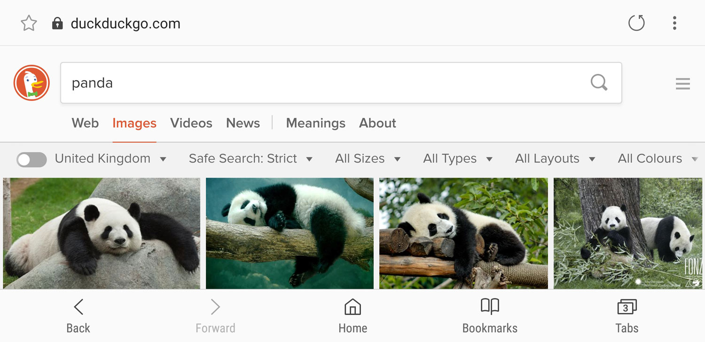
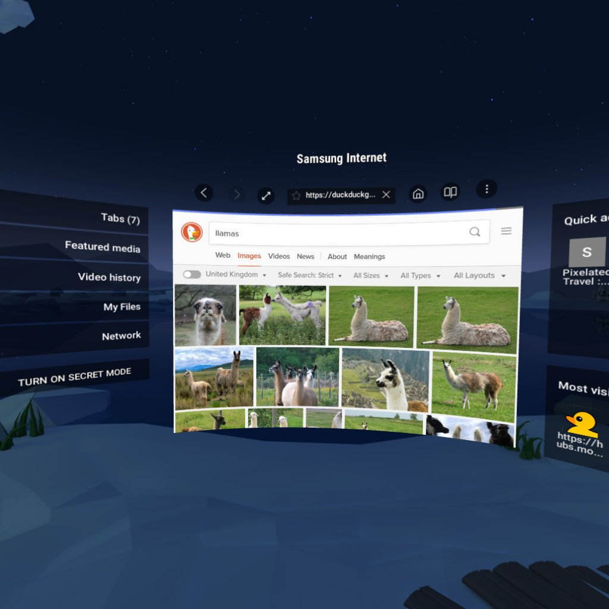

  
  
Samsung Internet for Android is the web browser that is pre-installed on Samsung Galaxy phones and tablets. It is based on the open source Chromium project, to which Samsung are a major contributor.

<h2>Samsung Internet</h2>
      

Samsung Internet for Android is a simple, fast, and reliable web browser for your phone and tablet. It has replaced the stock Android browser on Samsung Galaxy devices since 2012, to provide a browser highly optimized for our devices.

  <section class="versions">
    <article class="version">
      <h3>Samsung Internet Gear VR</h3>
      
      
      
Samsung Internet for Gear VR lets you browse the web and enjoy contents in an immersive environment. Browse the web on a big screen, just as if you were at the theater.

      
    </article>
    <article class="version">
      <h3>Samsung Internet Beta</h3>
      
      
      
Introducing the Samsung Internet Beta, giving you early access to the newest features of the secure, private and optimized mobile web browser.

      
    </article>
  </section>

  <h2>Press Coverage</h2>
  

    <section>
      <article class="ul_card">“Samsung is making a very, very strong case to become the default web browser for your Android devices.”<a href="https://www.androidauthority.com/samsung-internet-browser-android-793983/"> Android Authority</a></article>
      <article class="ul_card">“Android’s best mobile browser… After using them all on various devices, the best I have found is the Samsung Internet browser.”<a href="https://www.zdnet.com/article/thanks-samsung-androids-best-mobile-browser-now-available-to-all/"> ZDNet</a></article>
      <article class="ul_card">“[Use] it once and you’ll immediately notice the speed difference. Samsung Internet feels much faster. It is also better at a lot of the things that you might find limiting in Chrome, like the download manager. And in a surprise move, the Samsung internet browser actually uses much less battery than Chrome too.”<a href="https://www.makeuseof.com/tag/mobile-browser-alternatives-chrome-safari/"> makeuseof.com</a></article>
      <article class="ul_card">“This mobile browser was built specifically for Samsung devices, but people liked it so much that the company made it available for download on all Android phones.”<a href="https://www.wired.com/story/alternative-mobile-browsers/"> Wired</a></article>
      <article class="ul_card">“Once upon a time, no one would even consider using a handset manufacturer’s web browser on its own phones, much less install one on another phone. But here we are today, with Samsung’s Internet Browser being one of the best choices available in the Play Store.”<a href="https://www.howtogeek.com/348934/the-best-web-browsers-for-android/"> HowToGeek</a></article>
    </section>
    <aside class="side-column">
      <h4>Further Reading</h4>
      
If you would like to learn more about Samsung Internet and the story behind it, these articles provide further background:

      <ul>
        <li><a href="https://medium.com/@torgo/the-big-browser-you-haven-t-heard-of-yet-481a1b48517b">The Big Browser You Haven't Heard Of Yet</a></li>
        <li><a href="https://www.smashingmagazine.com/2016/10/whats-the-deal-with-the-samsung-internet-browser/">What’s The Deal With The Samsung Internet Browser?</a></li>
        <li><a href="https://medium.com/samsung-internet-dev/introducing-samsung-internet-for-developers-6c3a3be42f72">Introducing Samsung Internet for developers</a></li>
        <li><a href="https://medium.com/samsung-internet-dev/think-you-know-the-top-web-browsers-458a0a070175">Think you know the top web browsers?</a></li>
        <li><a href="https://medium.com/samsung-internet-dev/because-browser-diversity-is-good-for-the-web-910d1cbcdf3b">Because browser diversity is good for the web</a></li>
        <li><a href="/diversity-inclusion-statement">Our diversity & inclusion statement for participation in and sponsorship of events</a></li>
      </ul>
    </aside>
  

<section class="disclaimer">
  <h3>Disclaimer</h3>
  
Our <a href="https://medium.com/samsung-internet-dev/">Medium publication</a> and our blog on <a href="/">this website</a> are not official channels endorsed or sponsored by Samsung Electronics Co., Ltd. We are web developers who write articles, tutorials and opinions about web technologies primarily of interest to other web developers, along with other developer-relevent features for Samsung Internet and related products/services.

  
Information provided and opinions expressed on this website are ‘those of the authors’ and do not reflect the official recommendations or policies of Samsung Electronics Co., Ltd. For the official word about Samsung Internet and other Samsung products, see <a href="https://developer.samsung.com/internet">developer.samsung.com/internet</a>.

</section>