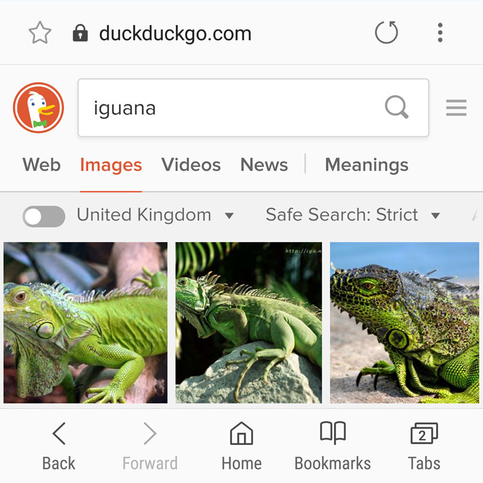

  

    

    

Samsung Internet for Android is the web browser that is pre-installed on Samsung Galaxy phones and tablets. It is based on the open source Chromium project, to which Samsung are a major contributor.

  

  

    

      <h2>Samsung Internet</h2>
            
      
Samsung Internet for Android is a simple, fast, and reliable web browser for your phone and tablet. It has replaced the stock Android browser on Samsung Galaxy devices since 2012, to provide a browser highly optimized for our devices.

      
    

    

      <h3>Samsung Internet Gear VR</h3>
      
      
      
Samsung Internet for Gear VR lets you browse the web and enjoy contents in an immersive environment. Browse the web on a big screen, just as if you were at the theater.

      
      
    

    

      <h3>Samsung Internet Beta</h3>
      
      
      
Introducing the Samsung Internet Beta, giving you early access to the newest features of the secure, private and optimized mobile web browser.

      
    

  

  <h2> Press Coverage</h2>
  

    
lolo

    
<h4>Further Reading</h4>
      
If you would like to learn more about Samsung Internet and the story behind it, these articles provide further background:

      <ul>
        <li><a href="https://medium.com/@torgo/the-big-browser-you-haven-t-heard-of-yet-481a1b48517b">The Big Browser You Haven't Heard Of Yet</a></li>
        <li><a href="https://www.smashingmagazine.com/2016/10/whats-the-deal-with-the-samsung-internet-browser/">What’s The Deal With The Samsung Internet Browser?</a></li>
        <li><a href="https://medium.com/samsung-internet-dev/introducing-samsung-internet-for-developers-6c3a3be42f72">Introducing Samsung Internet for developers</a></li>
        <li><a href="https://medium.com/samsung-internet-dev/think-you-know-the-top-web-browsers-458a0a070175">Think you know the top web browsers?</a></li>
        <li><a href="https://medium.com/samsung-internet-dev/because-browser-diversity-is-good-for-the-web-910d1cbcdf3b">Because browser diversity is good for the web</a></li>
      </ul>
    

  

